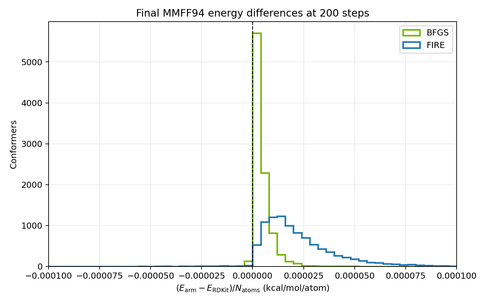
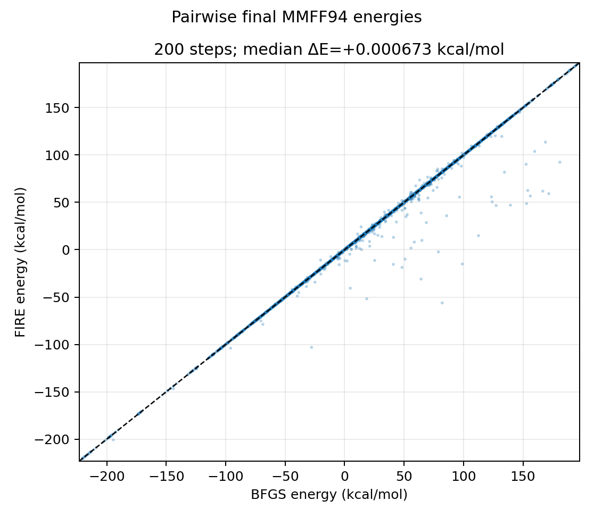

.. SPDX-FileCopyrightText: Copyright (c) 2026 NVIDIA CORPORATION & AFFILIATES. All rights reserved.
.. SPDX-License-Identifier: Apache-2.0

FIRE minimizer
==============

nvMolKit provides the Fast Inertial Relaxation Engine (FIRE) as an
alternative to BFGS for MMFF94 and UFF geometry optimization.

The implementation follows the FIRE 2.0 update scheme. See the original
`FIRE paper <https://doi.org/10.1103/PhysRevLett.97.170201>`_, and the
`FIRE 2.0 paper <https://doi.org/10.1016/j.commatsci.2020.109584>`_

Using FIRE
----------

Select FIRE with ``minimizerKind="FIRE"``. BFGS remains the default.
The return value and in-place coordinate updates are the same for both
minimizers.

.. code-block:: python

    from rdkit import Chem
    from rdkit.Chem.rdDistGeom import ETKDGv3

    from nvmolkit.embedMolecules import EmbedMolecules
    from nvmolkit.mmffOptimization import MMFFOptimizeMoleculesConfs
    from nvmolkit.types import FireOptions

    smiles = ["CCO", "c1ccccc1O", "CC(=O)NC1=CC=C(C=C1)O"]
    mols = [Chem.AddHs(Chem.MolFromSmiles(smiles)) for smiles in smiles]

    params = ETKDGv3()
    params.useRandomCoords = True
    EmbedMolecules(mols, params, confsPerMolecule=10)

    options = FireOptions()
    options.gradTol = 1e-4

    energies = MMFFOptimizeMoleculesConfs(
        mols,
        maxIters=200,
        minimizerKind="FIRE",
        fireOptions=options,
    )
    # energies[i][j] is the final energy of conformer j of molecule i.

UFF uses the same FIRE options:

.. code-block:: python

    from nvmolkit.uffOptimization import UFFOptimizeMoleculesConfs

    energies = UFFOptimizeMoleculesConfs(
        mols,
        maxIters=400,
        minimizerKind="FIRE",
        fireOptions=options,
    )

The batched-forcefield interfaces also accept ``minimizerKind="FIRE"`` and
``fireOptions=options`` in their ``minimize`` methods.

A conformer is converged when the 2-norm of its full gradient is no greater
than ``gradTol``. Independent conformers are batched on the GPU; the adaptive
state and the convergence decision remain per conformer.

Parameters and tuning
---------------------

The default values in :class:`nvmolkit.types.FireOptions` were selected with
an `Optuna <https://optuna.org/>`_ study at a fixed budget of 200 iterations.

Defaults were tuned on MMFF94, but were independently verified to be valid
for UFF optimization and distance-geometry embedding.

.. _fire-validation:

Validation
----------

The validation used 10,000 noise-perturbed MMFF94 conformers sampled from the
Enamine REAL 10M collection. RDKit MMFF94, nvMolKit BFGS at 200 steps,
nvMolKit FIRE at 200 steps, and nvMolKit FIRE at 400 steps all started from
the same coordinates. Final geometries from every arm were re-scored with
RDKit MMFF94 so energy and residual-gradient comparisons use one
implementation.

.. list-table:: Final RDKit-MMFF94 energy over 10,000 conformers
   :header-rows: 1
   :widths: 36 20 20 24

   * - Arm
     - Mean (kcal/mol)
     - Median (kcal/mol)
     - Correlation with RDKit
   * - RDKit MMFF94, 200 steps
     - 30.0764
     - 32.4748
     - 1.000000
   * - nvMolKit BFGS, 200 steps
     - 30.2991
     - 32.6047
     - 0.996979
   * - nvMolKit FIRE, 200 steps
     - 29.9992
     - 32.4451
     - 0.999752
   * - nvMolKit FIRE, 400 steps
     - 29.9979
     - 32.4442
     - 0.999752

At 200 steps, the median absolute FIRE-to-RDKit energy difference was already
near parity; 90% of conformers were within
:math:`6.41\times10^{-5}` kcal/mol/atom. At 400 steps the central
distribution tightened further: the median signed difference was
:math:`2.10\times10^{-6}` kcal/mol/atom and 90% were within
:math:`1.25\times10^{-5}` kcal/mol/atom. The remaining tail is dominated by
arms reaching different nearby minima rather than a systematic energy offset.

   Final-energy difference distributions. The right panel focuses on the
   central 90% of the FIRE distributions so the improvement from 200 to 400
   FIRE steps is visible.

   Pairwise BFGS/FIRE final energies from identical starting conformers.
   Most points lie on the parity line; points away from the diagonal identify
   conformers for which the optimizers reached different local minima within
   the iteration budget.

Residual gradients show that the energy agreement is not caused by accepting
high-force structures:

.. list-table:: Residual RDKit-MMFF94 gradient norm over 10,000 conformers
   :header-rows: 1
   :widths: 36 16 16 16 16

   * - Arm
     - Median
     - p90
     - p99
     - Maximum
   * - RDKit MMFF94, 200 steps
     - 7.72e-5
     - 1.59e-3
     - 0.605
     - 44.97
   * - nvMolKit BFGS, 200 steps
     - 2.16e-3
     - 2.28e-2
     - 0.961
     - 51.28
   * - nvMolKit FIRE, 200 steps
     - 1.02e-3
     - 6.55e-3
     - 0.0427
     - 0.250
   * - nvMolKit FIRE, 400 steps
     - 2.09e-4
     - 1.42e-3
     - 0.0106
     - 0.0742

Performance
-----------

At an equal iteration count, FIRE is roughly 2x faster than BFGS. Each FIRE
iteration only integrates a velocity and rescales a step, whereas BFGS
maintains and applies an inverse-Hessian approximation and performs a line
search.

Choosing FIRE or BFGS
---------------------

BFGS remains the default and is the conservative choice when reproducing an
existing nvMolKit or RDKit workflow. FIRE is useful when a robust,
low-state optimizer is desirable or when a fixed iteration budget leaves a
heavy tail of BFGS residual gradients. Both algorithms are local optimizers,
and neither guarantees that two starting geometries—or two algorithms—will
reach the same basin.
